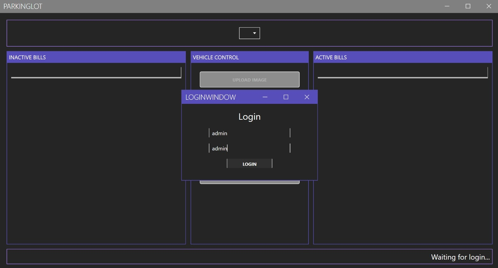
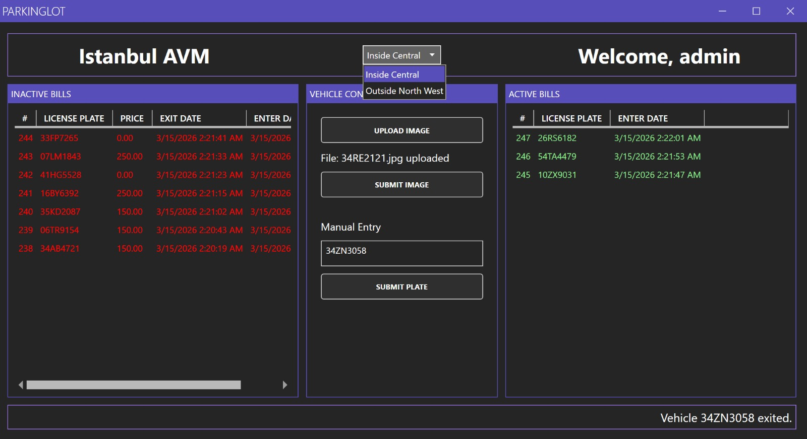
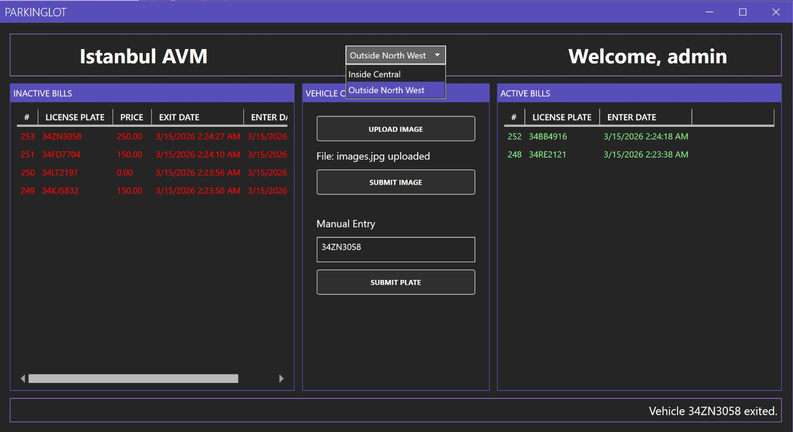

# 🚗 GeniusPark – ParkingLot Management

**GeniusPark** is an enterprise-level desktop application designed for companies to manage parking lot operations efficiently.

The system simulates a real-world parking lot attendant workflow by automatically detecting vehicle license plates from images and calculating parking prices based on the duration of the stay.

The application is built with a clean and simple interface to ensure ease of use for parking operators.

---

---

## 👤 Author

**Hakan Kocaman**

---

## 🎯 General Purpose

The main purpose of this project is to:

* Learn how **APIs communicate with each other**
* Understand **data flow between different technologies**
* Practice **machine learning integration with desktop applications**
* Build a **real-world parking lot management simulation**

---

## ✨ Features

* 🚘 **License Plate Detection** using Machine Learning
* ⏱ **Automatic Parking Price Calculation** based on parking duration
* 🔗 **Real-time communication** between services using APIs
* 🖥 **Desktop Interface** built with WPF
* 🔄 **Live UI updates** for active and completed parking bills
* 🗄 **SQL Server database integration**
* 📊 **Automated vehicle entry and exit tracking**

---

## 🛠 Technologies Used

* **C#**
* **WPF** – Desktop User Interface
* **ASP.NET Core** – Backend API
* **Python**
* **YOLO / ML Models** – License Plate Detection
* **FastAPI** – Python API
* **Uvicorn** – Python API Server
* **SQL Server** – Database Management

---

## 🏗 System Architecture

The project consists of three main components:

### 🖥 WPF Desktop Application (C#)

Handles the user interface and operator interactions.

### 🔌 ASP.NET Core API (C#)

Manages communication between the UI and the database.

### 🧠 Python ML Service (FastAPI)

Processes vehicle images and performs license plate detection.

### 🗄 SQL Server Database

Stores application data including companies, parking bills, and pricing rules.

All components communicate with each other using REST APIs, while the backend API manages interactions with the SQL Server database.

## 

---

## ⚙ Program Workflow

1. 📷 Operator uploads a car image (`.png` or `.jpeg`)
2. 📤 Image is sent to the **Python ML service**
3. 🧠 ML model detects the **license plate**
4. 📥 Plate number is returned to the **C# application**
5. 🗄 System checks the database
6. 🚗 If the vehicle **is already inside**

   * Exit time is recorded
   * Parking price is calculated
7. 🆕 If the vehicle **is not inside**

   * A new parking bill is created
8. 📊 Bills are displayed in the UI as:

   * **Active Bills**
   * **Completed Bills**

---

## 📸 Screenshots

### 🏢 Login Screen

### 🏢 Parkinglot 1 Screen

### 🏢 Parkinglot 2 Screen

---

---

## 👤 Author

**Hakan Kocaman**

---

 
